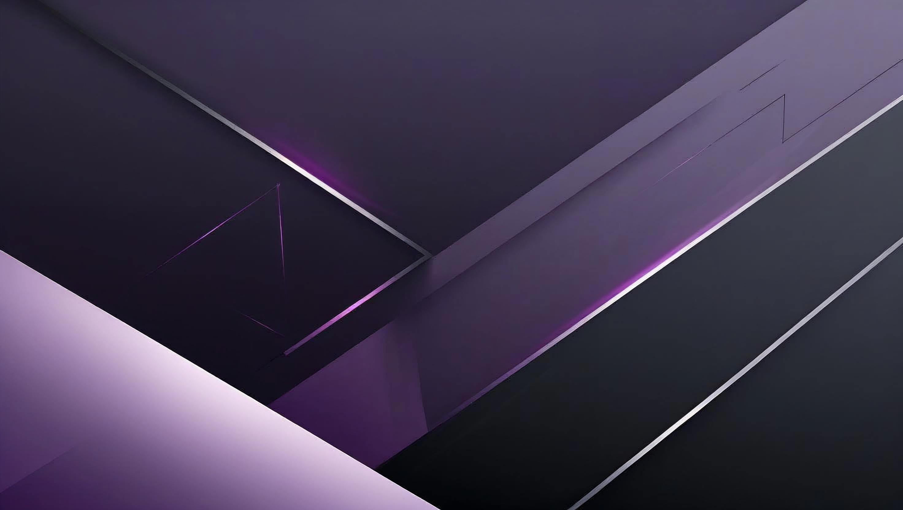

  

<h1 align="center">Huynh Tuan Khoa</h1>

  
  
  
  
  

  
  
  
  
  

---

## ⚔️ Operator Overview

I focus on **offensive security and adversary emulation**, building tools and workflows that simulate real-world attack paths.

My work emphasizes:

- Privilege escalation & lateral movement mechanics  
- Vulnerability discovery and exploit analysis  
- Defense evasion research  
- Custom tooling & automation for security operations  
- Systems-level understanding (C++ / low-level behavior)

I prefer depth over surface. Execution over theory.

---

## 🧠 Current Focus Areas

- Active Directory exploitation & trust relationships  
- Reverse engineering & binary analysis  
- Detection bypass strategies  
- Attack surface automation

<b>📚 Currently Exploring</b>

 
- Kernel-mode rootkit techniques (Windows internals)  
- EDR hooking and evasion via direct syscalls  
- CI/CD pipeline security testing  

---

## 🛠 Technical Arsenal

### Languages
`C++` `Python` `Rust` `Bash` `PowerShell`

### Security Tools
`Burp Suite` `Nmap` `Metasploit` `BloodHound` `Ghidra` `Wireshark`

### Web & Software Engineering
`React` `Node.js` `Tailwind` `MySQL` `Linux`

---

## 🚀 Featured Work

### 🔎 Offensive Security Projects

#### [🛡️ CTF Tools Suite](https://github.com/rRoyal1504/ctf-tools-suite)

> Custom-built security tooling for lab-based penetration testing practice, automation workflows, and vulnerability validation.

#### [📡 Incident Detection System](https://github.com/rRoyal1504/incident-detection)

> Sensor-integrated AI verification system for incident recognition and contextual validation using OpenCV.

---

### 🌐 Engineering Projects

#### [🌍 Portfolio Website](https://rroyal.xyz)
 
> Personal web portfolio with project showcase and security-focused branding.

---

## 📊 Competitive Programming

- Strong background in algorithm design & optimization  
- Heavy template-based C++ competitive programming workflow  
- Performance-focused data structures & problem-solving

---

## 📈 GitHub Activity

  
  

<!-- Optional: Recent Blog Posts (automated via GitHub Action) -->
<!-- BLOG-POST-LIST:START -->
<!-- BLOG-POST-LIST:END -->

---

## 📫 Connect & Collaborate

- 📧 **Email**: `amrroyalthedev [at] gmail [dot] com`  
- 🌐 **Portfolio**: [rroyal.xyz](https://rroyal.xyz)  
- 💬 **Discord**: `royal.sec` (for quick chats)

---

> “Security is not compliance. It is resistance.”
