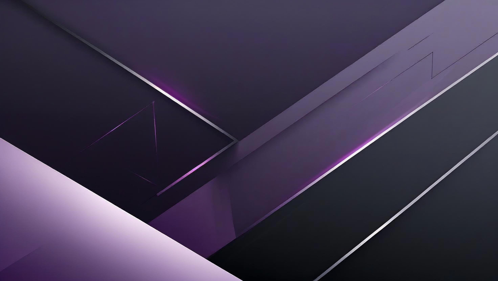

<!-- Banner -->

  

<h1 align="center">Hi, I'm rRoyal 👋</h1>
<h3 align="center">Cybersecurity Researcher • Full-stack Developer • Competitive Programmer</h3>

---

## 🚀 About Me
- 🔒 Specialized in **Cybersecurity**, competitive programming & full-stack solutions.
- 🏆 Experienced in **RAT/Trojan** (educational), obfuscation, and advanced algorithms.
- 📈 Passionate about security, automation, and AI-driven innovation.

---

## 🛠 Tech Stack

  

---

## 📂 Featured Projects
| Project | Description | Tech |
|---------|-------------|------|
| [**Portfolio Website**](https://rroyalthedev.vercel.app/) | Personal web portfolio with projects & resume | HTML, CSS (Tailwind) |
| [**THPTQG Countdown**](https://rroyal1504.github.io/thptqg-countdown/) | Live countdown to Vietnam's high school graduation exam | HTML, CSS, JS |
| [**Học bạ Calculator**](https://rroyal1504.github.io/hocba-calculator/) | GPA & priority score calculator for university entrance | HTML, CSS, JS |
| **Incident Detection System** | Sensor + AI accident detection & verification | Python, OpenCV, AI |
| **CTF Tools Suite** | Security tools for pentesting practice | Python, Bash |

---

## 📊 GitHub Stats

  
  

---

## 📫 Connect With Me

  
  
  

---

> ⚡ “Secure, innovative solutions & competitive programming.”
